## 셸 스크립트 프로그래밍2


### AND, OR 관계 연산자

1. and = `-a` 또는 `&&` 
2. or = `-o` 또는 `||` 


```
#!/bin/sh

echo "보고싶은 파일명을 입력하세요."
read fname

if [ -f $fname ] && [ -s $fname ] ; 	#일반 파일 and 파일 크기가 0이 아니면

then
	head -5 $fname
	
else
	echo "파일이 없거나, 크기가 0입니다."
	
fi
exit 0
```

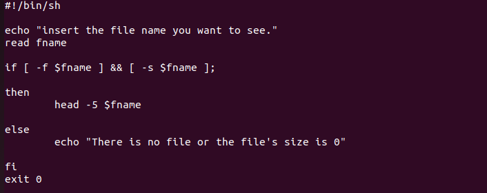

​	

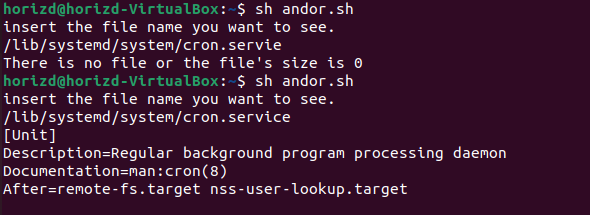


### 반복문 - for ~ in 문 (1)

**형식1**

```
for 변수 in 값1 값2 값3 ...
do
	반복할 문장
done
```


**형식2**	: 해당 형식은 sh가 아닌 bash에서 지원

```
for((i=1;i<=10;i++))
do
	반복할 문장
done
```

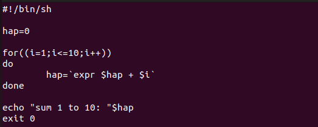


​					- 에러 왜 뜨는가?: sh에서는 for(())형식을 지원하지 않는다. bash로 실행하면 됨

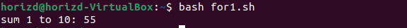


**형식3**

```
for i in `seq 1 10`
do
	반복할 문장
done
```

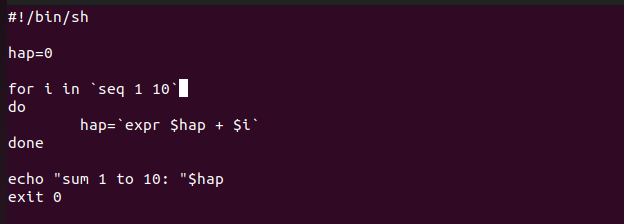


### 반복문 - for ~ in 문 (2)


아래는 현재 디렉터리에 있는 셸 스크립트 파일(*. sh)의 파일명과 앞 3줄을 출력하는 프로그램이다.

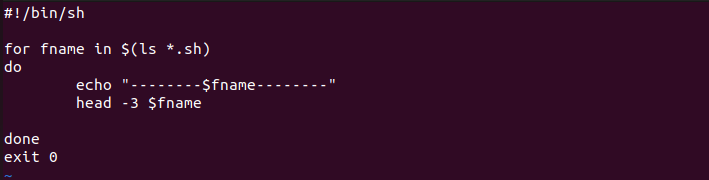

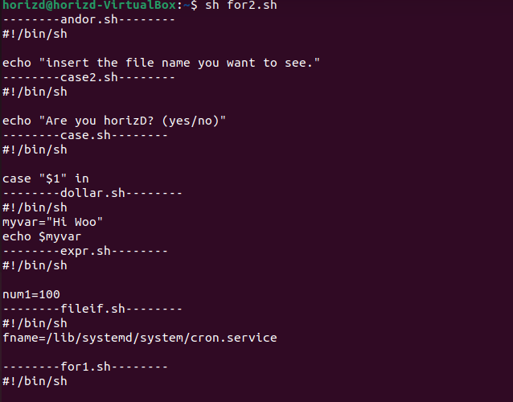

​			and so on...


### 반복문 - while문 (1)

조건식이 참인 동안 계속 반복

```
#!/bin/sh

while [ 1 ]
do
	echo "우분투 16.04 LTS"
done
exit 0
```


### 반복문 - while문 (2)

1에서 10까지의 합계를 출력하는 프로그램

​	- `-le`: less equal 10까지 ->  1 to 10 이하일때까지 반복

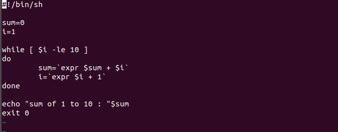


**+ until문 으로 수정**

until문은 반대로 조건식이 참일때까지 계속 반복 

```
until [ $i -gt 10 ]	
```

	- $i 변수값이 10 이상이 될때까지 반복


### while문 (3)

비밀번호를 입력받고, 맞을 때 까지 계속 입력받는 스크립트

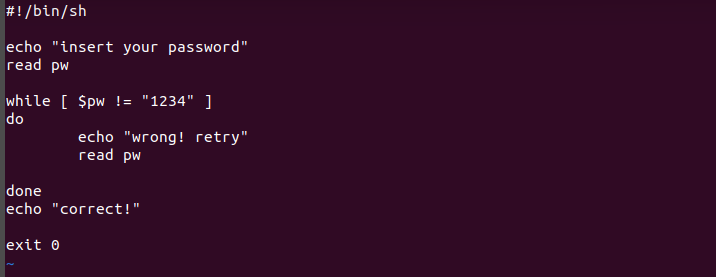

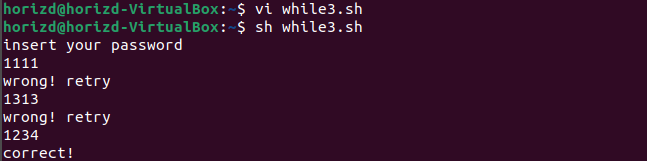


### break, continue, exit, return 문

1. `break`: 반복문 자체를 종료할 때 사용.
2. `continue`: 현재 명령부 실행을 멈추고, 반복문의 조건식으로 돌아가게 함
3. `exit`: 해당 프로그램 자체를 종료
4. `Return`: 함수 내부에서 사용되며, 함수가 호출된 곳으로 돌아가게 함

```
#!/bin/sh

echo "무한반복 입력을 시작한다 (b: break, c: continue, e: exit)"

while [1]; 
do
	read input
	case $input in
		b | B)
			break;;
		c | C)
			echo "continue를 누르면 while의 조건으로 돌아감"
			continue;;
		e | E)
			echo "exit을 누르면 프로그램(함수)를 완전히 종료"
			exit 1;;
esac;
done

echo "break를 누르면 while을 빠져나와 지금 이 문장 출력된다."

exit0
```


### 사용자 정의 함수

**형식**

```
함수이름 () {		#정의
	함수 명령부...
}

함수이름			#호출
```

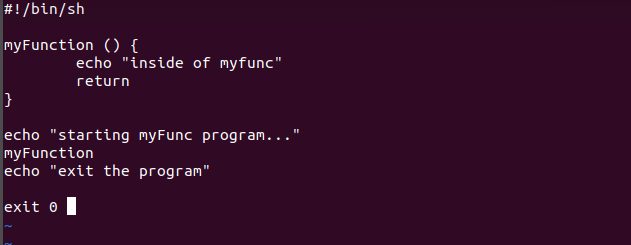


### 사용자 정의 함수, 파라미터

**형식**

```
funcName() {
	$1, $2 ...  등 파라미터 지정자 사용
}

funcName parameter1 parameter2		#함수 호출하며 함수의 인자 순서대로 함께 입력
```


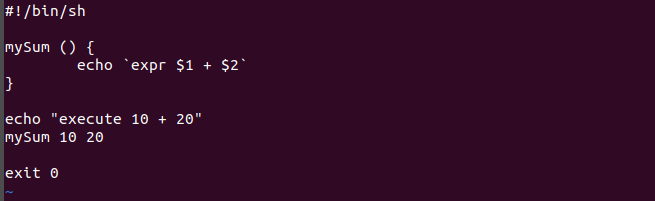


### eval (중요!)

문자열을 명령문으로 인식하여 실행

`eval $str` -> $str에 저장된 문자열 값을 명령문으로 실행

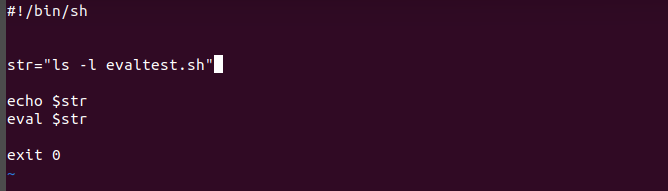

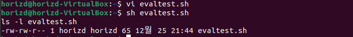


### export

외부 변수로 선언해준다. 즉, 선언한 변수를 다른 프로그램에서도 사용할 수 있도록 해준다.

(variable scope와 관련된 개념임)


아래의 예제로 설명

**exp1.sh**

```
#!/bin/sh

echo $var1	# var1은 exp2.sh 파일 내에 선언된 지역변수로 해당 파일은 접근 불가능
echo $var2	# 아래 exp2.sh 파일이 먼저 실행되며 var2는 외부변수로 접근 가능해졌음 

exit 0
```


**exp2.sh**

```
#!/bin/sh

var1="지역변수"
var2="외부변수"

export var2="외부변수"		#파일 밖의 범위에서 접근 가능한 외부변수로 반출

sh exp1.sh	# exp1.sh 실행
exit 0
```

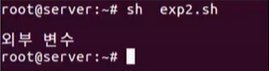


### printf

c언어의 printf() 함수와 비슷하게 출력 format을 지정하여 출력


1. `%`로 포맷 지정 가능
2. `%5.2f`, `$var1`: 전체 5자리, 소숫점 아래 2자리 수의 실수 형식 지정
3. `\n`: 줄바꿈
4. `\t`:  들여쓰기(tab)
5. `%s` ,`"var2"`: string 출력 지정 -> 뒤의 "var2" 값을 해당 자리에 문자열로 출력 

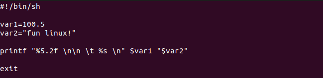

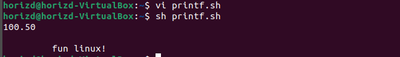


### set과 $(명령어)

`$(명령어)`: 리눅스 명령어 결과값을 문자열로 사용하기위해, 달러로 명령어를 지정

`set`: 명령어 실행 결과를 파라미터로 사용하고자 할 때, set으로 설정하여 사용


```
#!/bin/sh

echo "오늘 날짜는 $(date)입니다."

set $(date)
echo "오늘은 $4요일 입니다."

exit 0

```

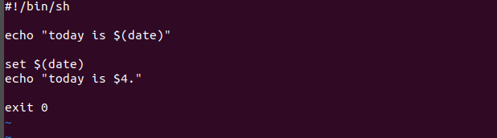

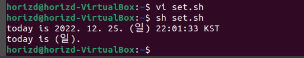


### shift

함수 호출 시 입력받은 다수의 파라미터 변수가 있을 떄, 

함수 내부에서 shift 명령이 실행된다면, 다음 차례의 파라미터 인자를 땡겨와서(shift) 대입한다.

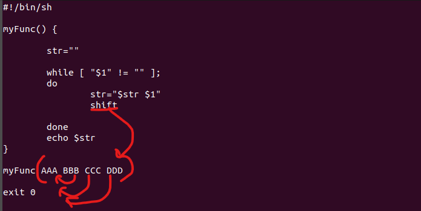

​	- `$1`에 들어가는 파라미터가 AAA, BBB, CCC, DDD순서로 하나씩 땡겨지는 것

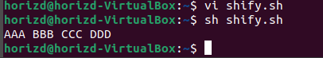