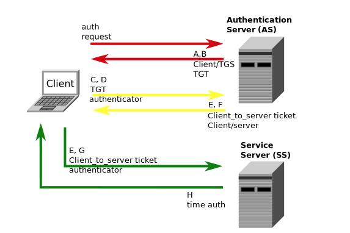
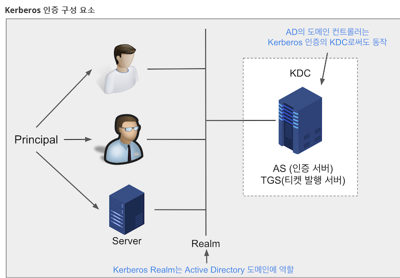
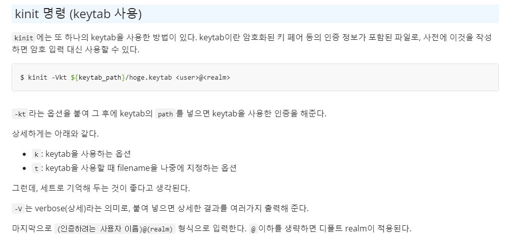

## 커버로스 프로토콜

커버로스 프로초콜이란 **티켓 기반**의 **컴퓨터 네트워크 인증 프로토콜**이다.

보안이 보장되지 않은 네트워크 환경에서, 요청을 보내는 클라이언트와 요청을 받는 서버가 서로의 신뢰성을 확보하기 위해 사용된다.

클라이언트와 서버를 상호 인증 할 수 있을 뿐 아니라, 데이터 보존을 위해 클라-서버 간 통신을 암호화 한다. SSO(Single Sign-On)의 일종으로, 여러 시스템의 접근 관리 기능을 제공한다.


키워드만 요약하자면 아래와 같다.

1. **`클라이언트 - 서버 구조`**에서
2. **`서버 접근권한에 대한 관리`**를 위해 
3. **`대칭키 방식` **을 이용해 인증하는
4. **`네트워크 인증 암호화 프로토콜`**


아래와 같은 경우에 사용한다.

1. 서버의 수가 많아지고, 유저의 수도 많아져서 사용자와 권한에 대한 관리 비용이 높아지는 경우
2. 서버 별로 접근 가능한 사용자를 관리해야 할 때
3. 서버가 추가될 때마다 or 유저가 추가/삭제 될 때마다 유저를 등록,관리해야 하는 경우


***티켓이란?**: 커버로스에서 사용하는 티켓은 유저 아이디를 안전하게 전달하는 데 사용되는 정보 패킷이다. 티켓에 포함되는 대표적인 정보들은 다음과 같으며, 이런 정보들을 담고 있는 티켓은 티켓을 발급하는 비밀 키로 암호화 된다.

1. 유저 아이디
2. 유저 호스트의 IP주소
3. 타임 스탬프
4. 티켓 수명을 정의하는 값
5. 세션 키


### 커버로스 프로토콜의 동작 요약




### 대표 구성요소

```
AS, TGS, SS 를 순차적으로 거치는 과정을 통해 클라이언트와 서버가 서로 신뢰할 수 있게 된다.
```

- 서비스를 제공받는 **`client`**

- **`인증을 제공할 AS(Authentication Server)`**: 

  요청을 보내는 **client의 아이디와 패스워드를 인증**하고, **`TGS(Ticket Granting Service)`와 통신하기 위한 `티켓`**을 유저에게 발급해주는 서버이다.

  

- **`티켓을 발행해주는 TGS(Ticket Granting Service)`**: 

  **`SS(Service Server,= Resource Server)`와 통신하기 위한 티켓**을client에게 발급해주는 서비스이다.

  

- **`서비스를 제공하는 SS(Service Server, Resource Server)`** : 

  클라이언트가 **최종적으로 통신하고자하는 목적지 서버**
  
  


```
커버로스에서 클라이언트는 TGS, SS와 통신을 하게 되므로, 두개의 세션 키를 필요로 한다.
```

- **`세션 키`**: 클라이언트와 서비스 간의 통신에 필요한 키로, 비밀 키와는 다른 개념이다.

- **세션 키**는 **티켓 안에 들어갈 데이터** 중 하나이기에, **AS는 TGS 세션 키**를 가지고 있고, **TGS는 SS 세션키**를 가지고 있다.

  

- **`비밀 키`**: 서비스가 유저에게 만들어서 보내줄 티켓을 **암호화**하거나, 서비스가 유저로부터 전달받은 **티켓의 복호화**를 위해 가지고 있는 키이다.

- 티켓의 복호화를 위해 **TGS는 TGS 비밀키**를 가지고 있고, SS는 SS 비밀키를 가지고 있다.


### 커버로스 프로토콜 동작과정

1. **사용자 클라이언트 기반 로그인**

   1. **클라이언트**는 사용자로부터 `아이디`와 `비밀번호`를 입력받는다.

   2. 비밀번호를 `대칭키`로 변환해 `암호키`를 생성

      

2. **클라이언트 인증**
   1. **클라이언트**는 **AS**에게 사용자 `아이디`를 전송
   2. **AS**는 사용자 `아이디로 DB를 조회`, `두개의 메시지`를 생성 및 응답
      - **메시지A**: 클라이언트 비밀번호 기반으로 `Client / TGS 세션 키` 생성
      - **메시지B**: TGS의 비밀키로 `TGT를 암호화`
      - **TGT**: `Client ID` + `network ip` + `expired time`+ `TGS 세션 키`
   3. 1-2 에서 만든 **암호 키를 기반으로, 메시지 A를 해독**(DB의 비밀번호와 사용자가 입력한 비밀번호가 동일하면 성공)하고 **TGS 세션 키를 획득**. 클라이언트는 TGS 비밀키를 갖고 있지 않으므로 해독하지 않고 가지고 있음


3. **고객 서비스 인증**

   1. **클라이언트**는 메시지 A, B를 통해 `메시지 C와 D를 생성`한다.

      - **메시지 C**: TGT + Service ID
      - **메시지 D**: `클라이언트 ID + 타임스탬프`를 TGS 세션 키로 암호화, 생성된 메시지는 AS의 TGS로 전송됨

   2. **TGS**는 메시지C, 메시지D를 기반으로 메시지E, 메시지F 를 생성한다.

      - **메시지 E**: Client to Server Ticket => Server Secret key로 암호화 
        - (TGS와 SS는 Server Secret key를 알고 있으므로 해독 가능)
      - **메시지 F**: Client / Server Session Key => Client /TGS 세션 키로 암호화

      -> 여기서 생성된 메시지는 클라이언트에게 전송됨


4. **고객 서비스 요청**
   1. 메시지 E와 F를 받은 사용자는 서비스를 이용할 자격을 갖췄음. 클라이언트가 서비스를 제공받기 위해 메시지 E, G를 SS에게 전송함
      - 메시지 E: 3-2에서 받은 Client to Server Ticket
      - 메시지 G: `클라이언트 ID + 타임스탬프` => Client / Server 세션 키로 암호화
   2. SS는 E와 G를 통해 클라이언트 신원을 확인 및 일치 시, 메시지 H를 통해 Client에게 신원을 확인시켜줌
      - 메시지 H: `메시지 D의 타임스탬프 + 메시지 G의 타임스탬프` => Client/Server 세션 키를 통해 암호화
   3. 메시지 H를 받은 Client는 해독 후, 타임스탬프를 확인 및 SS에 서비스 요청 시작


### 동작 요약

		1. `client`가 `KDC(=AS+TGS)`에 `TGT`를 요청
		1. `KDC`는 `TGT + 세션키`를 응답
		1. `client`는 다시 `KDC`에 `티켓`과 `Auth`를 요청
		1. `KDC`는 `티켓+세션키`를 응답
		1. `client`는 `SS(서비스 서버)`에 `Request서비스`와 `Auth`를 요청
		1. `리소스 서버`는 `Server Authentication`을 응답


### Kerberos 명령어 

Heimdal Kerberos 기준 명령어이다.


**kinit** : 티켓 생성

```
# (1)default realm 외 티켓 생성 (principal 예시: your_id@your_realm)
kinit -p your_principal

# (2) keytab을 이용한 티켓 생성
kinit -t your_keytab
```

```
keytab 생성 및 keytab 이용 티켓 발급 예시

# keytab 생성
ktutil -k kai-hana.keytab.mobility.hadoop add -p kai-hana@MOBILITY.HADOOP -e aes128-cts-hmac-sha1-96-V 1

# keytab이용 티켓 발급
kinit -t kai-hana.keytab.mobility.hadoop -p kai-hana@MOBILITY.HADOOPE
```


**kdestroy** : 티켓 삭제

- 티켓을 순차로 1개만 삭제하므로, 여러 티켓이 있을 경우 주의
- --all 옵션으로 모든 티켓 삭제 가능

```

```


**klist** : 티켓 목록 확인

```
klist -l	# 모든 티켓 목록 확인

klist -vA	# 모든 티켓 상새내용 확인 (macOS: klist -vA, linux: klist -aA)
```


**ktutil** : keytab 생성/관리 기능

- `-k`로 keytab 위치 지정
  - `add`로 keytab 생성
    - `-p`로 principal 기술
    - `-e`로 encrypt type 지정
    - `-V`로 version 기술
  - `list`로 keytab 내용 확인

```
# keytab 생성 예시
ktutil -k kai-hana.keytab.mobility.hadoop add -p kai-hana@MOBILITY.HADOOP -e aes128-cts-hmac-sha1-96-V 1
```

```
사용할 수 있는 ip가 지정된 티켓과 달리, keytab의 경우 접근만 가능하면 쓸 수 있어
다른 서버로 옮겨 사용이 가능하다.
```




